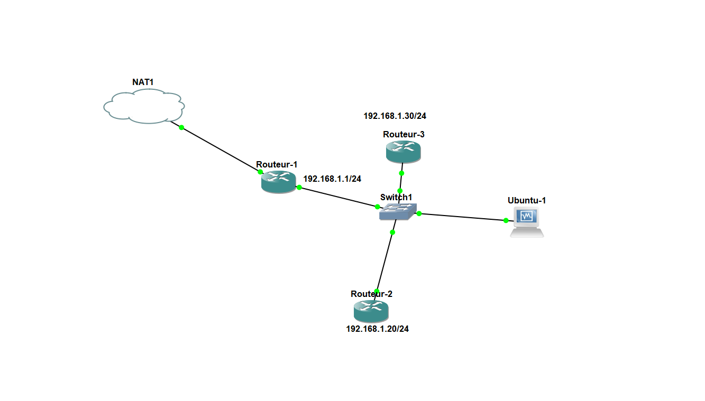
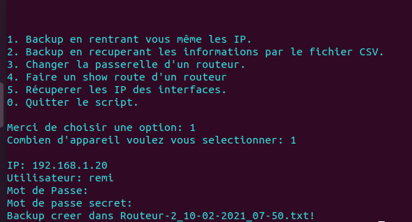
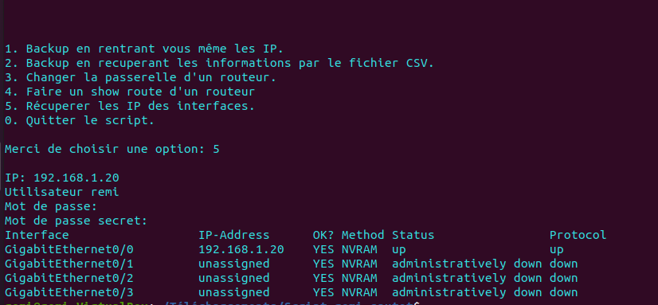

# Projet 6 pour Openclassroom

# __Script Python pour routeur cisco__

## Description

J'ai créé ce script en python pour pouvoir automatiser certaines tâches avec des routeurs en connexion SSH.

Les configuration Ciscode votre appareil seront enregistrées dans un dossier avec le nom d'hôte, la date et l'heure. Vous avez la possibilité de tout importer à partir d'un fichier CSV ou de lui donner manuellement l'adresse IP, le nom d'utilisateur, le mot de passe secret de chaque hote.

## Pré-requis
Il est nécessaire d'avoir un accès SSH sur les routeurs ciblés, ainsi que d'un utilisateur sur chaque routeur.

## Installation
* pip3 install -r requirements.txt

## Configuration

Si vous souhaite utiliser un fichier CSV pour l'utiliser dans le script il suffit de suivre les indications dedans.

## Démarrage

Dans l'invite de commande il suffit d'executer le "script-python.py"

Exemple avec Ubuntu : $ python3 run.py 

## Utilisation

Depuis le menu, il suffit de selectionner l'option qui vous interesse.

Si vous choisissez l'option CSV, vous aurez besoin dudit fichier CSV dans le même répertoire que le script Python. Il copiera la configuration enregistrée dans un dossier nommé Backup-Configs dans le même répertoire du fichier python. Le nom du fichier de configuration sera le nom d'hôte, la date et l'heure du périphérique Cisco.

## Exemples

Les test ont étés efféctues sur GNS3 avec plusieurs routeurs et une machine sous Ubuntu 20.04.

Pour le backup il est possible de récuperer le fichier CSV ou vous aurez au préalable rempli avec les informations concernant les routeurs.

Pour faire un show interface sur le routeur souhaité :

