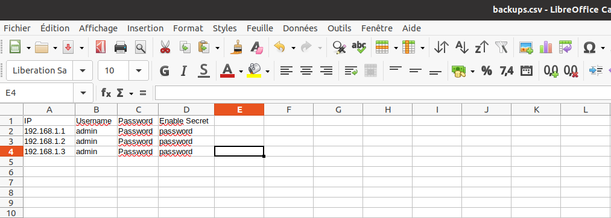
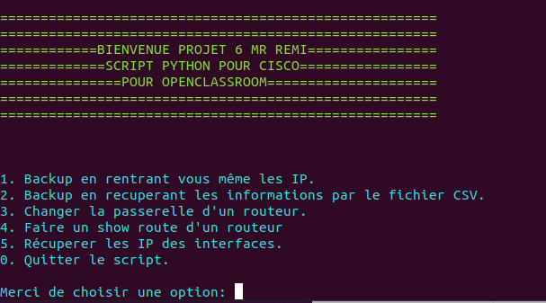

# Projet 6 pour Openclassroom

# __Script Python pour routeur cisco__

## Description

J'ai créé ce script en python pour pouvoir automatiser certaines tâches avec des routeurs SSH. Le backup des configs peut être activé en saissant les adresses IP manuelement ou directement en important un fichier CSV.

## Pré-requis
Il est nécessaire d'avoir un accès SSH sur les routeurs ciblés, ainsi que d'un utilisateur sur chaque routeur.

## Installation
* pip3 install -r requirements.txt

## Configuration

Si vous souhaite utiliser un fichier CSV pour l'utiliser dans le script il suffit de suivre les indications dedans.

## Démarrage

Dans l'invite de commande il suffit d'executer le "script-python.py"

Exemple avec Ubuntu : $ python3 run.py 

## Utilisation

Depuis le menu, il suffit de selectionner l'option qui vous interesse.

Pour le backup il est possible de récuperer le fichier CSV ou vous aurez au préalable rempli avec les informations concernant les routeurs.

