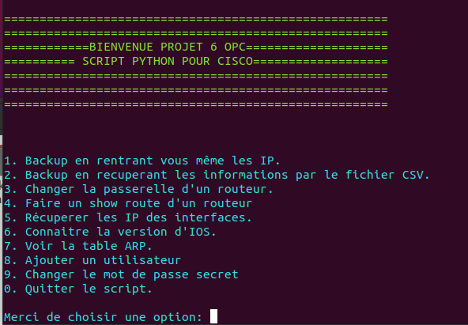
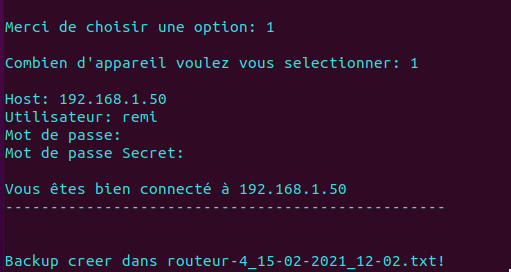
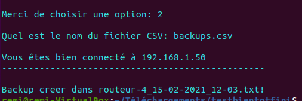
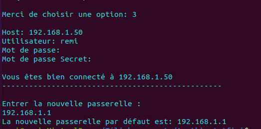
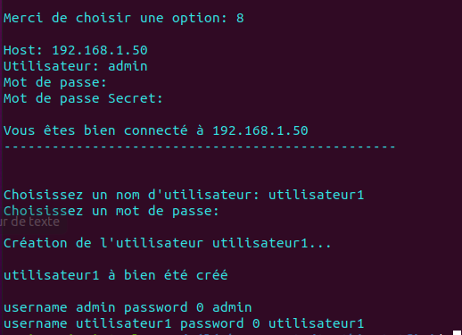
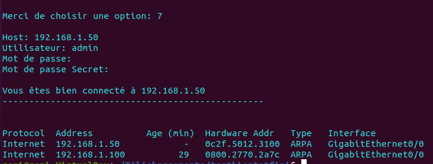

# __Script Python automatisation pour routeur cisco__
# Explications en français (If you want the explanation in english click [here](https://github.com/rouki69/P6.OPC#explanation-in-english) !
_(Pour Openclassroom Projet 6)_

 

## Description

J'ai créé ce script en python pour pouvoir **automatiser certaines tâches avec des routeurs en connexion SSH**.

Les configuration Cisco de votre appareil seront enregistrées dans un dossier avec le nom d'hôte, la date et l'heure. Vous avez la possibilité de tout importer à partir d'un fichier CSV ou de lui donner manuellement l'adresse IP, le nom d'utilisateur et le mot de passe secret de chaque hôte. 

Voici les possibilités avec ce script:
* Faire un back-up en tapant directement les informations ou depuis un fichier CSV.
* Changer la passerelle d'un routeur.
* Voir les adresses IP des interfaces.
* Connaître la version d'IOS utilisée. 
* See the ARP table.
* Add a user on the router.
* Changer le mot de passe secret (le mot de passe changé sera le "secret" et non le "enable". Il sera stocké sous forme de hashage MD5).

## Pré-requis
Il est nécessaire d'avoir un accès **SSH** sur les routeurs ciblés, ainsi que d'**un utilisateur** sur chaque routeur.

## Installation
Il est nécessaire d'avoir pip3 installé pour pouvoir récuperer les informations dans le fichier **requirements.txt**

_(Exemple sur Ubuntu20.04)_

`sudo apt install python3-pip`

`pip3 install -r requirements.txt`

## Configuration

Si vous souhaite utiliser un fichier CSV pour l'utiliser dans le script, il suffit d'ajouter les information du routeur que vous souhaitez joindre, en remplissant chaque colonne (host, username, password,enable password).
Le dossier pour les back-up sera automatiquement créé là où se situe le script.

Pour le back-up manuel, il vous sera demandé le nombre d'appareils que vous souhaitez séléctionner. Pour les autres options, elles ne seront utilisables que sur un seul routeur à la fois.

## Démarrage

Dans l'invite de commande, il suffit d'exécuter le "script-python.py"

Exemple avec Ubuntu : $ python3 run.py 

## Utilisation

Depuis le menu, il suffit de sélectionner l'option qui vous intéresse.

Si vous choisissez l'option CSV, vous aurez besoin dudit fichier CSV dans le même répertoire que le script python. Il copiera la configuration enregistrée dans un dossier nommé Backup-Configs dans le même répertoire du fichier python. Le nom du fichier de configuration sera le nom d'hôte, la date et l'heure du périphérique Cisco.

## Laboratoire de test

Les test ont étés effectués avec [GNS3](https://gns3.com/) avec plusieurs routeurs et une machine sous Ubuntu 20.04.

## Exemples

##### Backup manuel:
Voici un exemple pour un back-up fait avec les routeurs choisis manuellement :

##### Backup avec CSV:
Un back-up avec les données des routeurs récupérées directement depuis un fichier CSV:

##### Passerelle par défaut:
Modification de la passerelle par défaut:

##### Utilisateurs:
Ajout d'un utilisateur avec le nom et le mot de passe choisis directement via le script:

##### Table ARP:
Voir la table ARP du routeur sélectionné:

## Problème d'utilisation
Si vous avez un problème avec le script vous pouvez déposer un message [ici](https://github.com/rouki69/P6.OPC/issues) si jamais vous avez un soucis d'utilisation avec le script.

## Contact

## Licence

-----------------
-----------------
-----------------

# __Script Python automation for cisco router__
# Explanation in English
_(For Openclassromm project 6)_

 

## Description

I have created this script in  python to be able to **automate some tasks with routers with SSH connections**.

The Cisco configuration of your device will be recorded in a file with  the name of the  host, the date and the time. You have the possibility to import it all fromr a CSV file  or to give it the IP address manually, the user name and the password of each host. 

Here are the possibilities with this script:
* Do a back-up, typing directly the information or from a CSV file.
* Change a router gateway.
* See the IP addresses of the interfaces.
* Know the IOS version that is used. 
* See the ARP table.
* Ajouter un utilisateur sur le routeur.
* Change the secret password (the changed password will be the "secret", not the "enable".It will be stored in the form of the MD5 hash).

## Requirements
It is necessary to have an access to **SSH** on the focused routers, as well as a **user** on each router.

## Installation
It is necessary that  pip3 is installled to be able to  recover the information in the **requirements.txt** file.

_(Exemple sur Ubuntu20.04)_

`sudo apt install python3-pip`

`pip3 install -r requirements.txt`

## Configuration

If you want to use a CSV file, to use it the script, you just have to add the information of the router that you want to reach by filling in each column (host, username, password,enable password).
The files for the back-ups will be automatically created where the script is. 

For the manual back-ups, the number of devices you want to select will be asked. For the other options, they will only be operable on one router by a time.

## Start-ups

In the command prompt, you just have to execute the "script-python.py".

Example with Ubuntu : $ python3 run.py 

## Use

From the menu, just select the option you are interested in. 

If oyu choose the CSV option, you will need the said CSV file in the same directory as the python script. It will copy the registered configuration in a file named Backup-Configs, in the same directory of the python file. The name of the configuration file will be the host, the date and the time of the Cisco device.

## Research laboratory

The tests have been made with  [GNS3](https://gns3.com/), with several routers and one server under Ubuntu 20.04.

## Examples

##### Manual backup:
Here is an example for a back-up created with the hosts manually chosen.

##### Backup with CSV:
A back-up with the data of the routers directly recovered from a CSV file:

##### The default gateway:
Modification of the default gateway:

##### Users:
Addition of a user with the name and the password directly chosen from the script:

##### Table ARP:
Here is the ARP table of the selected router:

## User problem
You have a problem with the script, you can drop a message [here](https://github.com/rouki69/P6.OPC/issues) I will try to answer you as quickly as possible

## Contact

## Licence

